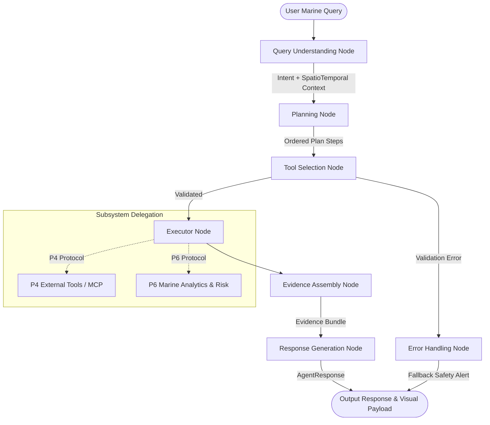

# Agent Orchestration Module (P3)

Welcome to the **Agent Orchestration Module** for the **Agentic AI Marine Intelligence Platform**.

This module is the central cognitive and workflow orchestration layer built using **LangGraph**. It manages query understanding, intent detection, spatio-temporal entity extraction, dynamic planning, multi-source data coordination, risk verification, evidence assembly, and role-tailored response synthesis.

---

## 👥 Ownership & Team Boundaries

To maintain clean separation and enable parallel hackathon development without merge conflicts, team responsibilities are strictly divided as follows:

| Role | Responsibility Area | Integration Boundary with P3 |
| :--- | :--- | :--- |
| **P1** | **Fisherman UI** (Mobile/Web interface for fishermen) | Consumes `AgentResponse` with `RoleType.FISHERMAN` & `VisualPayload` |
| **P2** | **Researcher & GIS UI** (Web dashboard for scientists) | Consumes `AgentResponse` with `RoleType.RESEARCHER` & GeoJSON layers |
| **P3** | **Agent & LangGraph Orchestration** *(THIS MODULE)* | **Owns state graph, query parsing, planning, evidence, synthesis** |
| **P4** | **Tools / MCP / External APIs** (INCOIS, NOAA, IMD) | Implements `P4ToolProvider` protocol; injected via `set_p4_provider` |
| **P5** | **Data Ingestion & Datasets** (NetCDF, GRIB, Bathymetry) | Upstream data layer providing feeds accessed by P4 & P6 |
| **P6** | **Marine Analytics & Deterministic Risk Calculations** | Implements `P6AnalyticsProvider` protocol; injected via `set_p6_provider` |

> [!IMPORTANT]
> **P3 DOES NOT** implement live external API clients (owned by P4), raw dataset ingestion pipelines (owned by P5), deterministic marine models / GIS math (owned by P6), or user interfaces (owned by P1/P2). P3 provides pluggable protocol interfaces with test mocks to enable independent development.

---

## 🏗️ Architecture & LangGraph State Machine



---

## 📁 Directory Structure

```
backend/agents/
├── __init__.py                 # Public package exports (run_marine_agent, etc.)
├── README.md                   # This integration guide
├── state/
│   ├── __init__.py
│   └── agent_state.py          # TypedDict AgentState container for LangGraph
├── schemas/
│   ├── __init__.py
│   ├── intent.py               # MarineIntent enums & classification models
│   ├── location_time.py        # Coordinates, BoundingBox, Spatial & Temporal contexts
│   ├── plan.py                 # PlanStep & ExecutionPlan schemas
│   ├── evidence.py             # EvidenceItem & EvidenceBundle schemas
│   └── response.py             # AgentResponse, SafetyAlert, VisualPayload schemas
├── prompts/
│   ├── __init__.py
│   ├── system_prompts.py       # Domain directives & role personas (Fisherman vs Researcher)
│   ├── intent_prompts.py       # Intent classification prompt templates
│   ├── extraction_prompts.py   # Spatio-temporal extraction prompts
│   ├── planning_prompts.py     # Execution plan templates
│   └── synthesis_prompts.py    # Evidence synthesis prompts
├── interfaces/
│   ├── __init__.py
│   ├── p4_tools.py             # Protocol contract and mock provider for P4
│   └── p6_analytics.py         # Protocol contract and mock provider for P6
├── nodes/
│   ├── __init__.py
│   ├── query_understanding.py  # Intent detection & entity extraction
│   ├── planning.py             # Plan generation for data/calculations
│   ├── tool_selection.py       # Pre-execution validation
│   ├── executor.py             # Dispatcher to P4 & P6 interfaces
│   ├── evidence_assembly.py    # Multi-source evidence aggregator
│   ├── response_generation.py  # Persona-tailored response synthesizer
│   └── error_handling.py       # Safety-first fallback handler
└── graph/
    ├── __init__.py
    ├── builder.py              # StateGraph builder and conditional router
    └── workflow.py             # High-level runner functions (run_marine_agent)
```

---

## 🔌 Teammate Integration Guide

### For P4: Connecting Live Tools & MCP Services
Create your implementation of `P4ToolProvider` and register it on startup:

```python
from backend.agents.interfaces.p4_tools import P4ToolProvider, set_p4_provider

class LiveP4ToolProvider:
    async def fetch_ocean_weather(self, location, forecast_horizon_hours=24):
        # Your real API / MCP call to INCOIS/NOAA
        return {"status": "success", "source": "INCOIS_LIVE", "data": {...}}

    async def fetch_sst_data(self, location, timeframe=None):
        return {"status": "success", "source": "COPERNICUS_SST", "data": {...}}

    async def fetch_chlorophyll_data(self, location, timeframe=None):
        return {"status": "success", "source": "NOAA_CHLOROPHYLL", "data": {...}}

    async def fetch_hazard_bulletins(self, location):
        return {"status": "success", "source": "IMD_BULLETINS", "data": {...}}

# Register your provider
set_p4_provider(LiveP4ToolProvider())
```

### For P6: Connecting Marine Analytics & Risk Models
Create your implementation of `P6AnalyticsProvider` and register it on startup:

```python
from backend.agents.interfaces.p6_analytics import P6AnalyticsProvider, set_p6_provider

class LiveP6AnalyticsProvider:
    async def calculate_sea_state_risk(self, weather_data, vessel_type="small_motorized_boat"):
        # Your deterministic safety calculation
        return {"status": "success", "source": "P6_RISK_CALCULATOR", "data": {...}}

    async def compute_pfz_zones(self, sst_data, chlorophyll_data, spatial_bounds=None):
        # Your PFZ thermal front & chlorophyll convergence algorithm
        return {"status": "success", "source": "P6_PFZ_CLUSTER_ENGINE", "data": {...}}

    async def detect_algal_bloom_risk(self, water_quality_data, spatial_bounds=None):
        return {"status": "success", "source": "P6_HAB_DETECTOR", "data": {...}}

# Register your provider
set_p6_provider(LiveP6AnalyticsProvider())
```

### For P1 & P2: Consuming Agent Responses in Frontend
Call the orchestrator with the appropriate role:

```python
from backend.agents import run_marine_agent, RoleType

# For Fisherman UI (P1)
response = run_marine_agent(
    query="Are there good fishing zones near Kochi tomorrow morning?",
    role=RoleType.FISHERMAN
)

# Access clean markdown and visual payload
print(response.markdown_content)
print(response.safety_alert)              # Banner with severity: safe_green, caution_yellow, danger_red
print(response.visual_payload.metric_badges)       # SST, Wave Height, Wind Speed
print(response.visual_payload.map_features_geojson) # GeoJSON points/polygons for map rendering
```

---

## 🚀 Quickstart & Standalone Testing

Run the module directly without needing external databases or infrastructure:

```bash
cd backend
python -c "
from agents import run_marine_agent, RoleType
res = run_marine_agent('What is the sea weather and fishing condition near Kochi tomorrow?', role=RoleType.FISHERMAN)
print(res.markdown_content)
"
```
