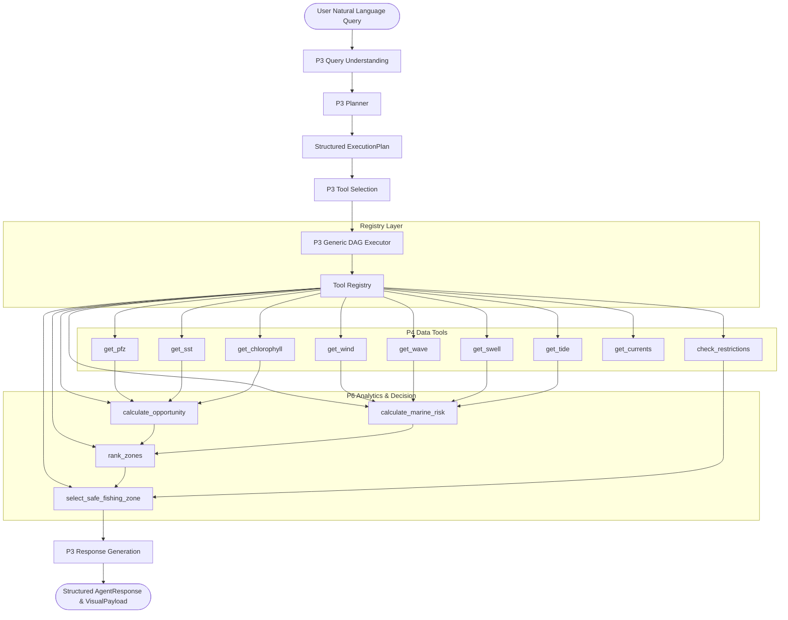

# Marine Intelligence Platform — Agent Orchestration (P3) & Tools Integration (P4)

This module implements the cognitive orchestration engine (**P3**) and data retrieval tools (**P4**) for the **Agentic AI Marine Intelligence Platform**.

---

## 👥 Architecture & Ownership Boundaries

```text
P3 = WHAT should happen (orchestration, planning, decision)
P4 = HOW data is obtained (retrieval, adapters, normalization)
P6 = HOW data is interpreted (marine risk, opportunity, calculations)
```



---

## 📦 Canonical Tool Result Contract (P4)

Every P4 tool conforms to the standardized envelope schema:

```python
{
    "status": "success",          # "success" | "partial" | "unavailable" | "error" | "failed"
    "source": "synthetic",        # "synthetic" | "INCOIS" | "Open-Meteo" | "Copernicus"
    "operation": "get_sst",       # Canonical operation name
    "observation_time": "...",    # ISO 8601 observation/satellite timestamp (or None)
    "valid_time": "...",          # ISO 8601 forecast validity timestamp (or None)
    "data": { ... },              # Normalized domain data
    "quality": "high",            # Data quality descriptor
    "metadata": { ... }           # Technical dataset provenance
}
```

### Time Semantics Contract
- **Satellite / Observation Tools** (`get_sst`, `get_chlorophyll`, `get_pfz`): Use `latest_available` temporal mode. Populates `observation_time`, while `valid_time` is `None`.
- **Forecast Tools** (`get_wind`, `get_wave`, `get_swell`, `get_tide`, `get_currents`): Use `forecast` temporal mode. Populates `valid_time`.

---

## 🛠️ Implemented P4 Tools

| Tool Operation | Data Provided | Temporal Mode | Source Label |
| :--- | :--- | :--- | :--- |
| `get_pfz` | Multi-zone coordinates, bearing, distance, species | `latest_available` | `synthetic` |
| `get_sst` | Mean SST, thermal gradient (°C/km), thermal fronts | `latest_available` | `synthetic` |
| `get_chlorophyll` | Chlorophyll-a density ($mg/m^3$), productivity proxy | `latest_available` | `synthetic` |
| `get_wind` | Speed (knots/m/s), direction, gusts | `forecast` | `synthetic` |
| `get_wave` | Significant wave height ($H_s$), period, direction | `forecast` | `synthetic` |
| `get_swell` | Swell height ($m$), period ($s$), direction | `forecast` | `synthetic` |
| `get_tide` | Tide phase (flood/ebb), water level ($m$), tide times | `forecast` | `synthetic` |
| `get_currents` | Current velocity (knots), direction | `forecast` | `synthetic` |
| `check_restrictions` | Marine protected areas, port security, ban zones | N/A | `synthetic` |

---

## 🔌 Swapping Between Mock and P4 Tools

The generic P3 DAG executor works transparently with both mock tools and P4 tools:

```python
from backend.agents.tools import use_p4_tools, use_mock_tools

# Switch to P4 tools
use_p4_tools()

# Switch to mock tools
use_mock_tools()
```

---

## 🧪 Testing

Run the full test suite (90 tests):

```bash
python -m unittest discover -s backend
```
